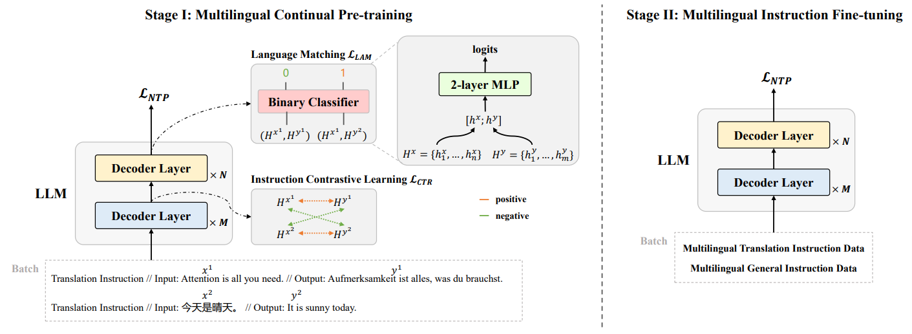

# AlignX: Advancing Multilingual Large Language Models with Multilingual Representation Alignment

This is the official repository for **EMNLP 2025 Main Conference** paper "AlignX: Advancing Multilingual Large Language Models with Multilingual Representation Alignment". 

In this paper, we propose **AlignX**, a two-stage and representation-level framework for enhancing the "align-then-diverge" pattern of LLMs and thus improves multilingual performance of pre-trained LLMs.



## Install
1. Clone this repository.

``` shell
git clone https://github.com/ictnlp/AlignX
```

2. Prepare training environment.

``` shell
conda create -n alignx python=3.9.12
conda activate alignx
pip install -r requirements.txt
```

3. Prepare evaluation environment.

    For evaluation, we use *MMT-LLM* for translation task, and *lm-evaluation-harness* for general task. 
``` shell
git clone https://github.com/NJUNLP/MMT-LLM.git
git clone https://github.com/EleutherAI/lm-evaluation-harness.git
```

## Start

To be updated...